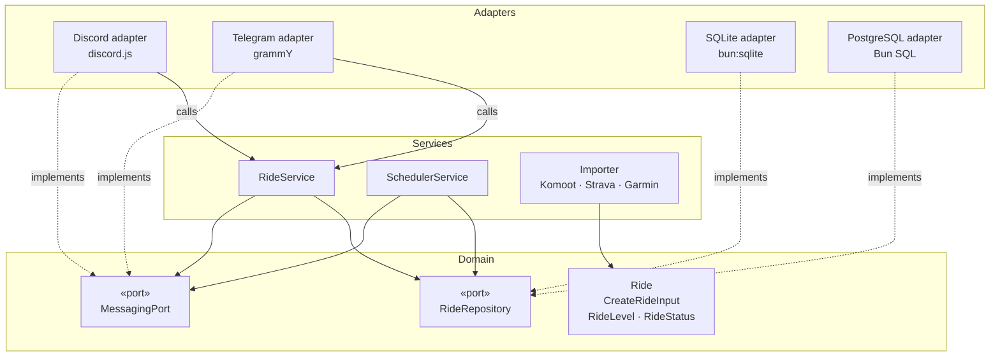
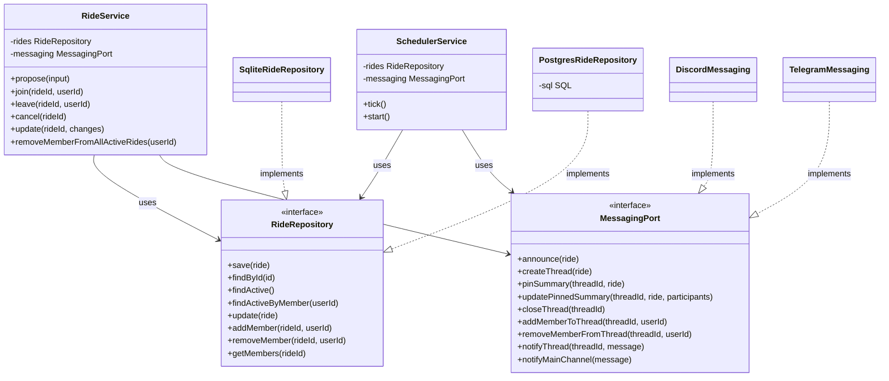
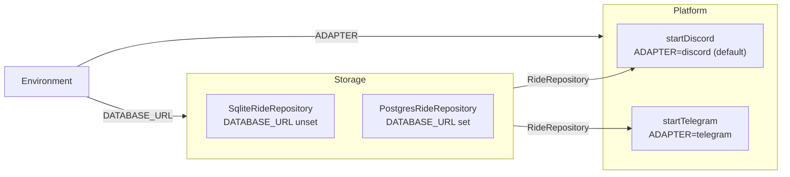

# Architecture

Group Ride follows a **Ports & Adapters** (hexagonal) architecture. The domain and business logic live at the centre and depend on nothing external. The outside world (databases, messaging platforms) plugs in through interfaces called *ports*.

**Dependency rule: adapters depend on the domain, never the other way around.**

---

## Layers



| Layer | Role | May import from |
|---|---|---|
| **Domain** | Core types and port interfaces | Nothing outside `domain/` |
| **Services** | Business logic | `domain/` only |
| **Adapters** | I/O implementations | `domain/`, `services/`, each other's `shared/` |

---

## Ports and implementations



---

## Runtime wiring (`index.ts`)

The adapter pair is chosen at startup from environment variables — the domain and services are unchanged regardless of the combination.



---

## File map

```
src/
├── domain/
│   ├── ride.ts                        # Ride, CreateRideInput, RideLevel, RideStatus
│   └── ports/
│       ├── ride.repository.ts         # RideRepository interface
│       └── messaging.port.ts          # MessagingPort interface
├── services/
│   ├── ride.service.ts                # RideService — orchestrates all ride operations
│   ├── scheduler.service.ts           # SchedulerService — reminders + auto-close
│   └── importer/                      # Komoot / Strava / Garmin URL importers
└── adapters/
    ├── shared/
    │   └── parse.ts                   # Date/stats parsing shared by Discord & Telegram
    ├── discord/                       # discord.js — implements MessagingPort
    │   ├── messaging.ts
    │   ├── commands/                  # /newride, /rides
    │   └── handlers/                  # join, leave, edit, participants, member events
    ├── telegram/                      # grammY — implements MessagingPort
    │   ├── messaging.ts
    │   ├── conversations/             # multi-step /newride flow
    │   └── handlers/                  # join, member events
    ├── sqlite/                        # bun:sqlite — implements RideRepository
    │   ├── db.ts                      # connection + auto-migration runner
    │   └── ride.repo.ts
    └── postgres/                      # Bun SQL — implements RideRepository
        ├── ride.repo.ts
        └── migrations/                # run manually with psql before first start
```
