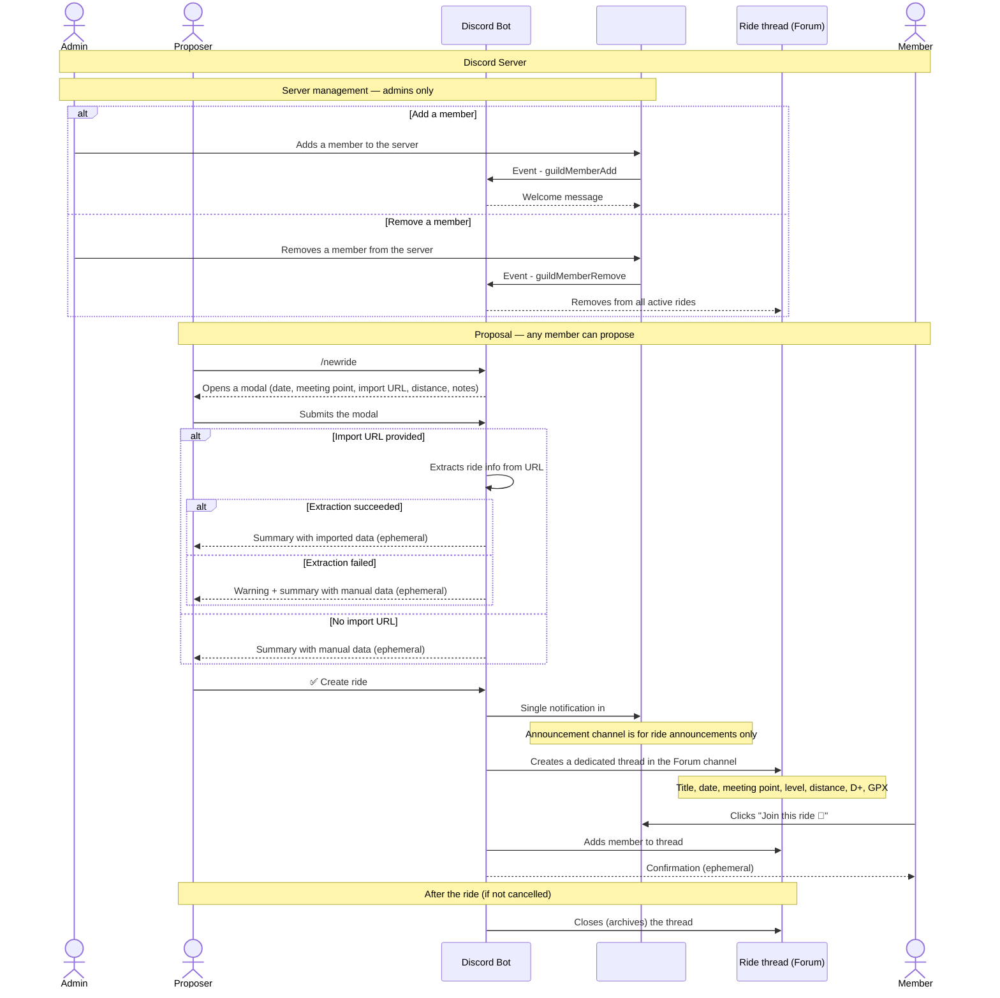

# Group Ride — Discord bot to organise group cycling rides

## Context and problem

A group of cycling friends communicates via a shared channel (WhatsApp, Signal…). When someone proposes a ride, everyone gets notified — including those who are not interested. The discussion that follows spams the entire group, and the relevant information ends up buried in the feed.

**Group Ride** is a Discord bot that solves this problem:
- a single notification in the announcement channel for each proposed ride
- an isolated thread per ride in a Forum channel, visible to registered participants
- the thread closes automatically 24 hours after the ride

---

## Platform: Discord

| Criteria | Discord | Telegram | WhatsApp |
|---|---|---|---|
| Official bot API | ✅ Free | ✅ Free | ⚠️ Paid + business badge |
| Threads per ride | ✅ Native (Forum Channels) | ✅ Native (Forum Topics) | ❌ |
| Native form (modal) | ✅ Yes | ❌ Conversation only | ❌ |
| Participant limit | ✅ None | ✅ None | ⚠️ 8 via API |
| Integration effort | Low | Low | High |

Discord offers native **modals** for structured input, which gives a much cleaner ride creation experience than a step-by-step conversation.

---

## Discord architecture

```
Discord Server
│
├── 📢 #announcements   → ride announcements only, no discussion
├── 🗂️ #rides (Forum)   → one thread per ride
│   ├── 💬 Ride May 25  → isolated discussion for registered members
│   ├── 💬 Ride Jun 1   → isolated discussion for registered members
│   └── ...
└── ...
```

The bot automatically creates a forum thread per ride and manages its full lifecycle.

---

## Roles

| Role | Permissions |
|---|---|
| **Admin** | Manage server members (add, remove, promote) |
| **Member** | Propose a ride, join/leave a ride, cancel a ride |

Any member can propose a ride. The organiser is not a fixed role — it is simply the member who proposes.

---

## Ride form

Each ride is described by:

- 📅 Date
- 📍 Meeting point
- 📏 Distance / D+ / D-
- 💪 Estimated level
- 🗺️ GPX track
- 🔗 Link to the source platform (Komoot, Strava, Garmin)
- 📝 Free notes

The form is displayed as the **starter message** of the ride thread and updated automatically on modification.

---

## Import from an external platform

The ride creation modal accepts an optional URL that pre-fills the form automatically:

- **Komoot** — public access, direct extraction
- **Strava** — may require the activity to be public on the profile
- **Garmin Connect** — same

If extraction fails (private activity or unavailable), the bot warns the proposer and falls back to the data entered manually in the modal.

---

## Sequence diagram



---

## Business rules

### Announcement channel
- Reserved for ride announcements. No discussion takes place here.
- On cancellation, the bot posts a notification there (justified exception: non-registered members also need to know).

### Ride thread
- Created automatically by the bot for each proposal.
- The starter message is the source of truth for the ride details.
- Any registered member can cancel the ride.
- The thread closes immediately on cancellation.
- The thread becomes read-only 24 hours after the ride.

### Member management
- Only admins can add or remove members from the server.
- If a member leaves or is removed, the bot automatically removes them from all active rides.

---

## Stack

- **Runtime**: [Bun](https://bun.sh)
- **Language**: TypeScript
- **Bot framework**: [discord.js](https://discord.js.org) v14
- **Database**: SQLite via `bun:sqlite`
- **Architecture**: Ports & Adapters — `domain/ports` defines interfaces, `adapters/` provides implementations

---

## Open questions

- **Joining after the initial announcement** — can a member register for a ride at any time, or only within a time window?
- **Member removal** — are other members registered for that member's active rides notified?
- **OAuth for Strava / Garmin** — should an authentication flow be modelled for private activities on these platforms?
