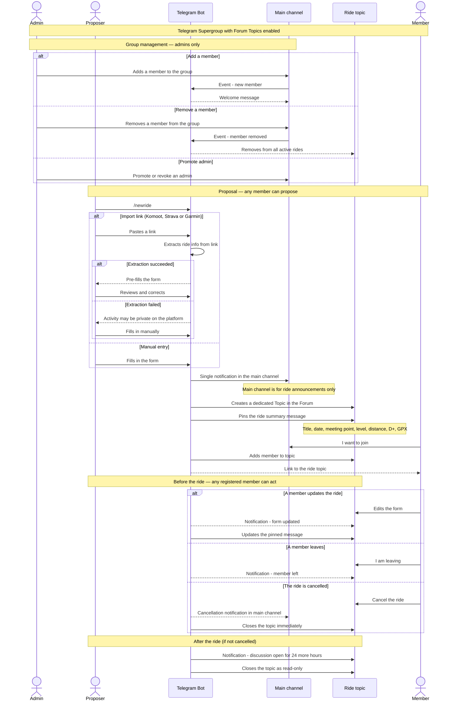

# Group Ride — Telegram bot to organise group cycling rides

## Context and problem

A group of cycling friends communicates via a shared channel (WhatsApp, Signal…). When someone proposes a ride, everyone gets notified — including those who are not interested. The discussion that follows spams the entire group, and the relevant information ends up buried in the feed.

**Group Ride** is a Telegram bot that solves this problem:
- a single notification in the main channel for each proposed ride
- an isolated discussion space (topic) per ride, visible to registered participants
- the discussion closes automatically 24 hours after the ride

---

## Platform: Telegram

| Criteria | Telegram | WhatsApp | Signal |
|---|---|---|---|
| Official bot API | ✅ Free | ⚠️ Paid + business badge | ❌ Unofficial only |
| Topics per ride | ✅ Native (Forum Topics) | ❌ | ❌ |
| Participant limit | ✅ None | ⚠️ 8 via API | ✅ None |
| Integration effort | Low | High | Very high |

Telegram is the only platform where this use case can be implemented natively, via a **supergroup with Forum Topics enabled**.

---

## Telegram architecture

```
Telegram Supergroup (Forum Topics enabled)
│
├── 📢 Main channel       → ride announcements only, no discussion
├── 💬 Topic: Ride May 25 → isolated discussion for registered members
├── 💬 Topic: Ride Jun 1  → isolated discussion for registered members
└── ...
```

The bot automatically creates a topic per ride and manages its full lifecycle.

---

## Roles

| Role | Permissions |
|---|---|
| **Admin** | Manage group members (add, remove, promote) |
| **Member** | Propose a ride, join/leave a ride, edit a ride, cancel a ride |

Any member can propose a ride. The organiser is not a fixed role — it is simply the member who proposes.

---

## Ride form

Each ride is described by:

- 📅 Date and time
- 📍 Meeting point
- 📏 Distance / D+ / D-
- 💪 Estimated level
- 🗺️ GPX track
- 🔗 Link to the source platform (Komoot, Strava, Garmin)
- 📝 Free notes

The form is displayed as a **pinned message** in the ride topic, and updated automatically on modification.

---

## Import from an external platform

The form can be pre-filled automatically from a link:

- **Komoot** — public access, direct extraction
- **Strava** — may require the activity to be public on the profile
- **Garmin Connect** — same

If extraction fails (private activity or unavailable), the bot tells the proposer that the activity may be private on the platform and falls back to manual entry.

---

## Sequence diagram



---

## Business rules

### Main channel
- Reserved for ride announcements. No discussion takes place here.
- On cancellation, the bot posts a notification there (justified exception: non-registered members also need to know).

### Ride topic
- Created automatically by the bot for each proposal.
- The pinned message is the source of truth for the ride details.
- Any registered member can edit the form or cancel the ride.
- The topic closes immediately on cancellation.
- The topic becomes read-only 24 hours after the ride.

### Member management
- Only admins can add or remove members from the supergroup.
- If a member is removed, the bot automatically removes them from all active rides.
- Promoting or revoking an admin is restricted to existing admins.

---

## Stack

- **Runtime**: [Bun](https://bun.sh)
- **Language**: TypeScript
- **Bot framework**: [grammY](https://grammy.dev)
- **Database**: SQLite via `bun:sqlite`
- **Architecture**: Ports & Adapters — `domain/ports` defines interfaces, `adapters/` provides implementations

---

## Open questions

- **Joining after the initial notification** — can a member register for a ride at any time, or only within a time window?
- **Member removal** — are other members registered for that member's active rides notified?
- **Re-registration** — can a removed member be re-added by themselves or only by an admin?
- **OAuth for Strava / Garmin** — should an authentication flow be modelled for private activities on these platforms?
