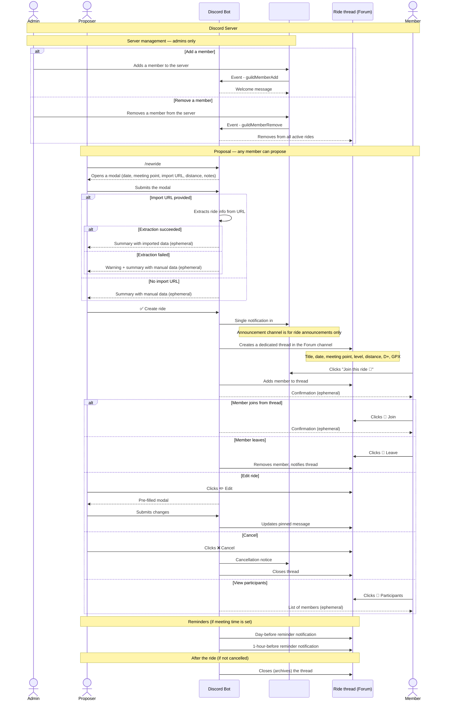

# Group Ride — Discord & Telegram bot to organise group cycling rides

[](https://github.com/Slashgear/group-ride/actions/workflows/ci.yml)
[](https://github.com/Slashgear/group-ride/releases)
[](https://github.com/Slashgear/group-ride/pkgs/container/group-ride)
[](https://bun.sh)
[](LICENSE)

**[Documentation →](https://group-ride.slashgear.dev)**

## Context and problem

A group of cycling friends communicates via a shared channel (WhatsApp, Signal…). When someone proposes a ride, everyone gets notified — including those who are not interested. The discussion that follows spams the entire group, and the relevant information ends up buried in the feed.

**Group Ride** is a Discord & Telegram bot that solves this problem:

- a single notification in the announcement channel for each proposed ride
- an isolated thread (Discord) or topic (Telegram) per ride, visible to registered participants
- the thread closes automatically 24 hours after the ride

---

## Supported platforms

| Criteria            | Discord                    | Telegram                 | WhatsApp                 |
| ------------------- | -------------------------- | ------------------------ | ------------------------ |
| Official bot API    | ✅ Free                    | ✅ Free                  | ⚠️ Paid + business badge |
| Threads per ride    | ✅ Native (Forum Channels) | ✅ Native (Forum Topics) | ❌                       |
| Native form (modal) | ✅ Yes                     | ❌ Conversation only     | ❌                       |
| Participant limit   | ✅ None                    | ✅ None                  | ⚠️ 8 via API             |
| Integration effort  | Low                        | Low                      | High                     |

Both Discord and Telegram are fully supported. Discord offers native **modals** for structured input; Telegram uses a step-by-step conversation flow. Select the adapter via the `ADAPTER` environment variable.

---

## Channel structure

**Discord** requires two channels:

```
Discord Server
│
├── 📢 #announcements   → ride announcements only, no discussion
├── 🗂️ #rides (Forum)   → one thread per ride
│   ├── 💬 Ride May 25  → isolated discussion for registered members
│   ├── 💬 Ride Jun 1   → isolated discussion for registered members
│   └── ...
└── ...
```

**Telegram** requires a supergroup with Topics enabled:

```
Telegram Supergroup (Topics enabled)
│
├── 📢 General thread   → ride announcements and join notifications
├── 🗂️ Ride May 25      → one topic per ride
├── 🗂️ Ride Jun 1       → one topic per ride
└── ...
```

The bot automatically creates a thread or topic per ride and manages its full lifecycle.

---

## Roles

| Role       | Permissions                                      |
| ---------- | ------------------------------------------------ |
| **Admin**  | Manage server members (add, remove, promote)     |
| **Member** | Propose a ride, join/leave a ride, cancel a ride |

Any member can propose a ride. The organiser is not a fixed role — it is simply the member who proposes.

---

## Ride form

Each ride is described by:

- 📅 Date
- 🕐 Meeting time (optional)
- 📍 Meeting point
- 📏 Distance / D+ / D- (optional, set manually or auto-filled from import)
- 💪 Estimated level (auto-filled from Komoot import)
- 🔗 Link to the source platform (Komoot, Strava, Garmin)
- 📝 Free notes

The form is displayed as the **starter message** of the ride thread and updated automatically on modification.

---

## Import from an external platform

The ride creation modal accepts an optional URL that pre-fills the form automatically:

- **Komoot** — public access; extracts name, distance, D+/D-, level, and link
- **Strava** — requires OAuth; only the link is saved, a warning is shown
- **Garmin Connect** — courses are not publicly accessible; only the link is saved, a warning is shown

If extraction fails (private activity or unavailable), the bot warns the proposer and falls back to the data entered manually in the modal.

---

## Sequence diagram (Discord)

> The Telegram flow is equivalent: `/newride` starts a step-by-step conversation instead of a modal, and threads are Telegram Topics instead of Forum threads.



---

## Business rules

### Announcement channel / General thread

- Reserved for ride announcements. No discussion takes place here.
- On cancellation, the bot posts a notification there (justified exception: non-registered members also need to know).

### Ride thread / Topic

- Created automatically by the bot for each proposal.
- The pinned message is the source of truth for the ride details.
- Any registered member can join, leave, edit, or cancel the ride via the action buttons.
- If a meeting time is set, the bot sends a reminder the day before and 1 hour before.
- The thread/topic closes immediately on cancellation.
- On Discord, the thread becomes read-only 24 hours after the ride.

### Member management

- On Discord, only admins can add or remove members from the server.
- If a member leaves or is removed, the bot automatically removes them from all active rides (both Discord and Telegram).

---

## Stack

- **Runtime**: [Bun](https://bun.sh)
- **Language**: TypeScript
- **Bot framework**: [discord.js](https://discord.js.org) v14 (Discord) · [grammY](https://grammy.dev) (Telegram)
- **Database**: SQLite via `bun:sqlite` (default) or PostgreSQL via Bun's native SQL — set `DATABASE_URL` to use PostgreSQL
- **Architecture**: Ports & Adapters — see [Architecture](https://group-ride.slashgear.dev/docs/architecture/) for diagrams and file map

---

## Open questions

- **Member removal** — are other members registered for that member's active rides notified?
- **OAuth for Strava / Garmin** — should an authentication flow be modelled to enable full data extraction for private activities?
