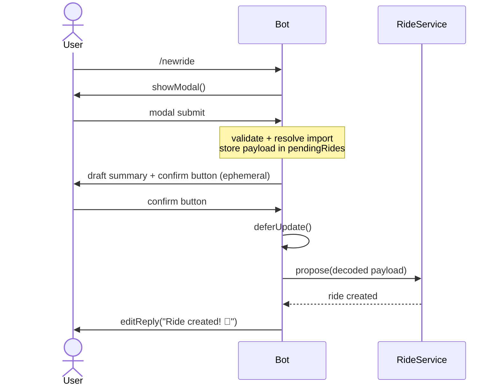
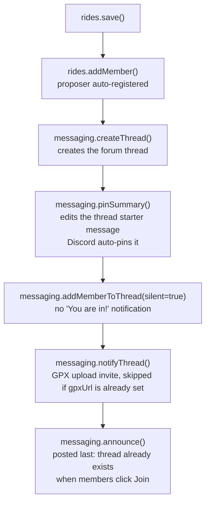
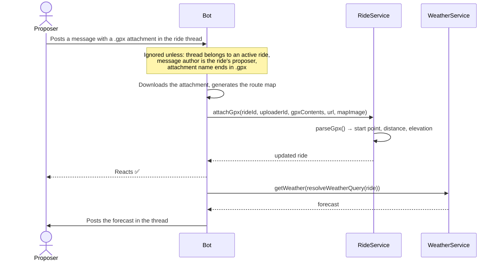

# Discord adapter

## Channel architecture

| Channel                           | Type  | Role                                                                                                                                                                       |
| --------------------------------- | ----- | -------------------------------------------------------------------------------------------------------------------------------------------------------------------------- |
| `DISCORD_ANNOUNCEMENT_CHANNEL_ID` | Text  | Bot posts ride announcements with a "Join" button. Should be read-only for members (configured in Discord server settings — not enforced by the bot).                      |
| `DISCORD_FORUM_CHANNEL_ID`        | Forum | One thread per ride. Thread membership controls notifications: joined members receive pings, others don't (but threads remain visible to anyone with access to the forum). |

---

## Ride creation — 3-step sequence

Discord interactions must be acknowledged within **3 seconds**, and modal fields cannot carry arbitrary payloads. This drives the following flow:

**Why `pendingRides`?** The confirm button's `customId` can only hold ~100 chars. The full ride payload (meeting point, stats, URL, notes…) is stored in-memory with a 10-minute TTL and referenced by a short random key.

---

## `propose()` — order matters

Inside `RideService.propose()`, steps are sequenced to satisfy Discord constraints:

---

## GPX upload in the ride thread

Discord modals can't accept file attachments, so a `.gpx` can't be uploaded from the `/newride` modal. Instead, a `messageCreate` listener (`handlers/gpx-upload.ts`) watches every ride thread for the proposer posting a `.gpx` file directly as a message:

Requires the **Message Content Intent** (Developer Portal → Bot → Privileged Gateway Intents) in addition to Server Members Intent — without it, `messageCreate` events arrive without attachments.

---

## Interaction patterns

All button and modal handlers follow the same Discord pattern to avoid the 3-second timeout:

- **Button that triggers async work** → `deferReply({ ephemeral: true })` then `editReply()`
- **Button that updates an existing message** → `deferUpdate()` then `editReply()`
- **Modal submit** → `deferReply({ ephemeral: true })` then `editReply()`

Ephemeral replies are used throughout so bot responses are only visible to the user who triggered the interaction.
