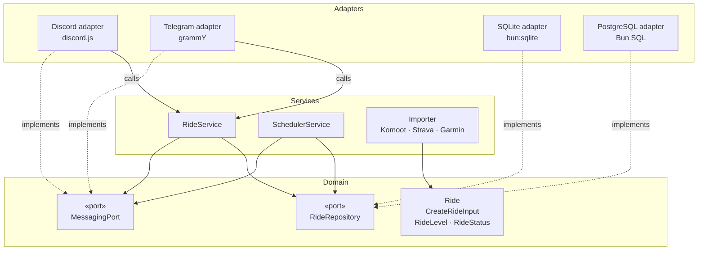
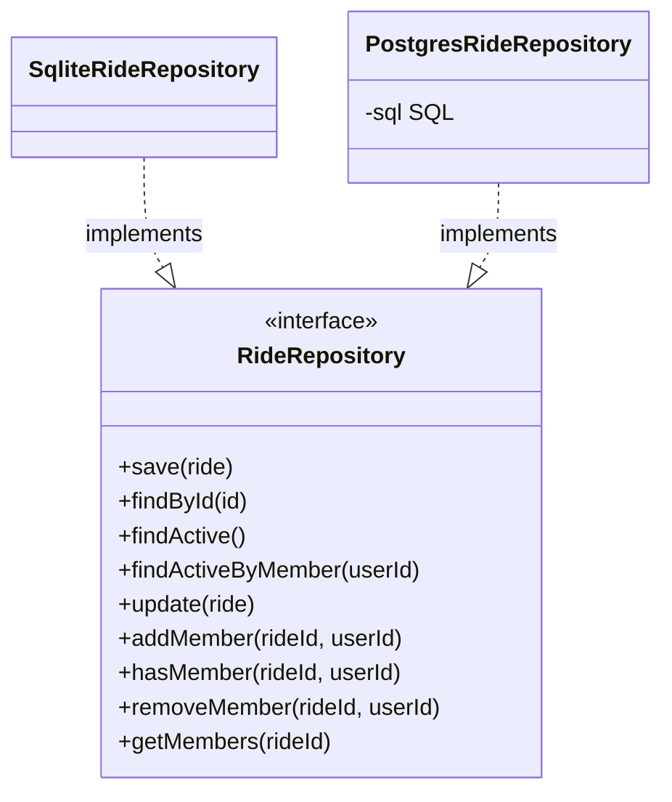
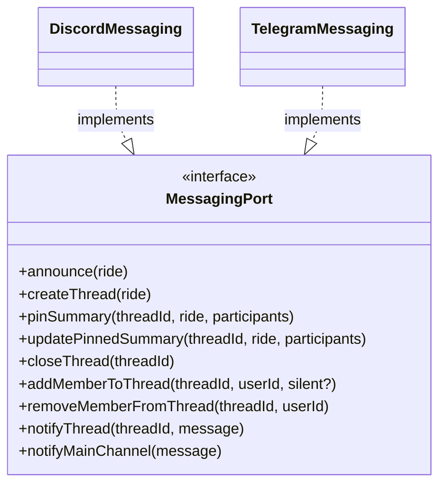
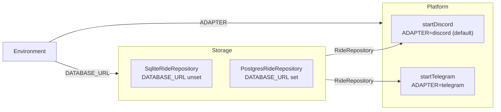

group-ride follows a **Ports & Adapters** (hexagonal) architecture. The domain and business logic live at the centre and depend on nothing external. The outside world (databases, messaging platforms) plugs in through interfaces called _ports_.

**Dependency rule: adapters depend on the domain, never the other way around.**

## Layers



| Layer        | Role                           | May import from                         |
| ------------ | ------------------------------ | --------------------------------------- |
| **Domain**   | Core types and port interfaces | Nothing outside `domain/`               |
| **Services** | Business logic                 | `domain/` only                          |
| **Adapters** | I/O implementations            | `domain/`, `services/`, shared adapters |

## Ports

### `RideRepository`

Abstracts persistence. Implemented by `SqliteRideRepository` and `PostgresRideRepository`.



### `MessagingPort`

Abstracts the messaging platform. Implemented by `DiscordMessaging` and `TelegramMessaging`.



## Runtime wiring

The adapter pair is chosen at startup from environment variables. The domain and services are the same regardless of which adapters are active.



## File structure

```
src/
├── domain/
│   ├── ride.ts                        # Ride, CreateRideInput, RideLevel, RideStatus
│   └── ports/
│       ├── ride.repository.ts         # RideRepository interface
│       └── messaging.port.ts          # MessagingPort interface
├── services/
│   ├── ride.service.ts                # RideService — orchestrates ride operations
│   ├── scheduler.service.ts           # SchedulerService — reminders + auto-close
│   └── importer/                      # Komoot / Strava / Garmin URL importers
└── adapters/
    ├── shared/
    │   └── parse.ts                   # Date/stats parsing shared by adapters
    ├── discord/                       # discord.js — implements MessagingPort
    │   ├── messaging.ts
    │   ├── commands/                  # /newride, /rides
    │   └── handlers/                  # join, leave, edit, participants, member events
    ├── telegram/                      # grammY — implements MessagingPort
    │   ├── messaging.ts
    │   ├── conversations/             # multi-step /newride flow
    │   └── handlers/                  # join, member events
    ├── sqlite/                        # bun:sqlite — implements RideRepository
    │   ├── db.ts                      # connection + auto-migration runner
    │   └── ride.repo.ts
    └── postgres/                      # Bun SQL — implements RideRepository
        ├── ride.repo.ts
        └── migrations/                # run manually before first start
```

## Adding a new adapter

To add a new messaging platform (e.g. Slack):

1. Create `src/adapters/slack/messaging.ts` implementing `MessagingPort`
2. Create `src/adapters/slack/start.ts` wiring commands and handlers
3. Add the `ADAPTER=slack` branch in `src/index.ts`
4. No changes to `domain/` or `services/` are needed
